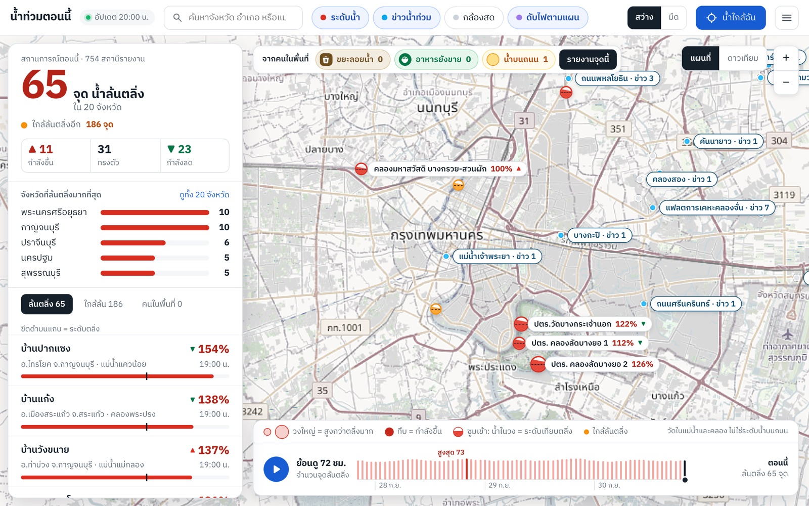
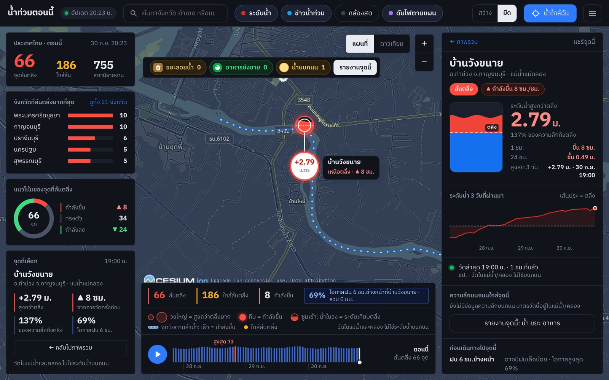

<div align="center">


# น้ำท่วมตอนนี้ · water-now

**Where in Thailand are rivers and canals over their banks right now, and what should you know before you go there?**

</div>

แผนที่ภาษาไทยที่เปิดมาแล้วเห็นทันทีว่าจุดวัดระดับน้ำไหนล้นตลิ่งอยู่ตอนนี้ ในจังหวัดไหน กำลังขึ้นหรือลง
พร้อมข้อมูลที่ช่วยตัดสินใจก่อนเดินทาง: ความลึกบนถนน ฝน ข่าว กล้องสด ไฟดับตามแผน สถานที่ใกล้เคียง
และรายงานจากคนในพื้นที่ แจ้งเตือนผ่าน Telegram ได้





## What it shows

- **Nationwide water levels.** About 800 ThaiWater gauges. The headline counts the gauges over their bank and the provinces they are in; the list is worst first.
- **Circles you can read.** Each over-bank gauge is a circle sized by the metres of water above the bank. Zoomed in, it fills like a tank against a dashed bank line, and the surface creeps up or sinks with the latest change. Near-bank gauges become small amber tanks.
- **Rivers that move (optional).** Dots run along the river or canal a gauge stands on, fast when its level is rising and slow when falling. Off until you switch it on.
- **Gauge detail.** Metres against the bank, 1-hour and 24-hour change, a 3-day chart, street depth where a resident or a headline reported one (with what can still get through: walking, motorcycle, car, pickup, boat), rain in the next 6 hours, nearby news, the nearest camera, planned outages, hospitals, schools, pharmacies and fuel, places still selling food, and emergency numbers.
- **72-hour replay** of how many gauges were over their banks, hour by hour.
- **Reports from people on the spot.** Street depth, trash floating in the water or blocking drains, and whether food is still on sale. Fixed choices only: no typing, no photos. Each report lasts 6 hours.
- **Live cameras.** iTIC road cameras, EGAT dam cameras and Bangkok drainage gauge cameras, played in a panel on the map.
- **Flood news by place.** Clips from 9 Thai news channels on YouTube, placed on the map when the headline names a Bangkok place.
- **Planned power cuts** announced by the Metropolitan Electricity Authority.
- **Telegram alerts** when a gauge near a subscriber rises into near-bank or over-bank, or an outage or flood clip is announced near them.
- **Light by default, dark dashboard behind a switch, and a bottom sheet on phones.** The original God's Eye View interface stays one tap away as โหมดขั้นสูง (advanced mode).

## What it does not tell you

- **A gauge measures the river or canal, not the street.** "Over the bank" means the water at the gauge is above its bank; it does not say how deep the road is. Street depth comes only from residents and headlines.
- **Nothing on the map paints flooded ground.** There is no flood-extent data behind it.
- **Resident reports are not verified.** Anyone can report any place.
- **News pins are Bangkok only.** The place list the headlines are matched against covers Bangkok.
- **Outages are planned ones in Bangkok, Nonthaburi and Samut Prakan only.** Unplanned cuts and the rest of the country are not covered.
- **The vehicle depth thresholds** follow general US flood-driving guidance, not a Thai authority's figures.
- **Speed of the river dots** is the level's change, not a measured current, and their direction is how the waterway is drawn in OpenStreetMap.

## Run it

Needs Node.js 24.14+ (or 26) and npm.

```sh
git clone git@github.com:SirawichDev/water-now.git
cd water-now
make install
make start        # alert service + map; open http://localhost:4173, Ctrl+C stops both
```

Both processes have to run: the map reaches the alert service through the dev server (`/api/bkk/*`), and without it the map loads with no water data. `make` on its own lists every command:

| Command | What it does |
|---|---|
| `make start` | Alert service and map together in this terminal; Ctrl+C stops both |
| `make up` / `make down` | The same in the background (logs in `.run/`), and stop it |
| `make status` / `make logs` | Is each one up; follow the background logs |
| `make alert` / `make map` | Only one of the two, in the foreground |
| `make env` | Create `alert-service/.env` from the example if it is missing |
| `make test` | All tests and the module boundary check |
| `make build` / `make preview` | Build for production and serve the build |

The map port is 4173; change it with `PORT`, for example `make start PORT=4190`. Without `make`, the same is `npm run alert` and `npm run dev`.

Optional settings:

| Where | Setting | What it does |
|---|---|---|
| `alert-service/.env` | `TELEGRAM_BOT_TOKEN` | A bot token from @BotFather. Without it, alerts are only written to the log. |
| `.env` | `CCTV_THAILAND_ONLY=1` | Loads only the Thai camera sources. |
| `.env` | `CESIUM_ION_TOKEN`, `GOOGLE_MAPS_API_KEY` | Only needed for advanced mode's 3D globe. The simple map uses OpenStreetMap and needs no key. |

Copy `alert-service/.env.example` to `alert-service/.env` to start. The alert service keeps its data in `alert-service/data/` (SQLite, git-ignored). Poll intervals and ports are in `alert-service/config.js`.

**Bot commands:** send your location to subscribe, then `/radius 3`, `/watch <place>`, `/unwatch <place>`, `/status`, `/stop`.

## How it fits together

```
browser ── map (Vite server, :4173) ──┬── /api/cctv/*  camera proxy (iTIC, EGAT, BMA DDS)
                                      └── /api/bkk/*   ─► alert service (:4191, SQLite)
                                                           ├─ ThaiWater    water levels, every 5 min
                                                           ├─ MEA          planned outages, every 30 min
                                                           ├─ YouTube      news clips, every 10 min
                                                           ├─ Overpass     places, food, river lines (cached 30 days)
                                                           ├─ Open-Meteo   rain forecast (cached 30 min)
                                                           └─ Telegram     alerts
```

| Folder | What is in it |
|---|---|
| `src/bkk/` | The Thai overview: panel, gauge detail, dock, report form, map overlays |
| `src/layers/bkk/` | The water, news, outage and camera layers and their players |
| `alert-service/` | Polling, SQLite, reports, the HTTP API and the Telegram bot |
| `server/providers/cctv/` | The Thai camera sources (`itic.js`, `egat.js`, `dds.js`) |
| `bkk-cams.html`, `bkk-news.html` | Camera wall and news list pages |

**[BKK-WATCH.md](BKK-WATCH.md)** has the details: every endpoint, how reports are merged into spots, the hourly history, the news matcher, the camera sources and the changes made to upstream files.

## Tests

```sh
npm test              # the whole project, including src/bkk
npm run test:alert    # the alert service
npm run check:boundaries
```

## Putting it online

The project is local-first. The alert service must run all the time and keep a database file, so a static host alone (for example Vercel's free plan) cannot run it. What works: keep it on your own machine behind a tunnel, or run it on a small always-on server. Before opening it to the public:

- Reports are rate-limited by the sender's address. Behind a tunnel or proxy every visitor arrives from the same address, so that has to be fixed first.
- Serve a build (`npm run build`, then `npm run preview`), not the dev server.
- Restrict any map keys you set, as described in [SECURITY.md](SECURITY.md).

## Data sources

| Data | From | Note |
|---|---|---|
| Water levels | ThaiWater (`api-v3.thaiwater.net`) | Gauges run by several agencies |
| Planned outages | Metropolitan Electricity Authority announcement pages | Read from the public page |
| News clips | 9 channels on YouTube (`alert-service/news/channels.json`) | Titles and links only; clips play in YouTube's own player |
| Places, food, rivers, Bangkok place names | OpenStreetMap via Overpass | © OpenStreetMap contributors, ODbL |
| Rain forecast | Open-Meteo | |
| Road cameras | iTIC Foundation feed published by Longdo Traffic | |
| Dam cameras | EGAT (`egatwater.egat.co.th`) | **Permission to re-show these images has not been asked** |
| Drainage gauge cameras | Bangkok Drainage and Sewerage Department | Still images; the feed had stopped updating when last checked |

Check each source's terms before running this as a public service.

## Credits and licence

น้ำท่วมตอนนี้ is built on **[God's Eye View](https://github.com/bilawalsidhu/gods-eye-view)** by Bilawal Sidhu, released under the MIT License. Its globe, camera pipeline and advanced mode come from there; its original guide is kept at [docs/GODS-EYE-VIEW-README.md](docs/GODS-EYE-VIEW-README.md). This project keeps the same [MIT License](LICENSE). Data from the sources above carries its own terms; see also [DATA_SOURCES.md](DATA_SOURCES.md) for the upstream datasets.
